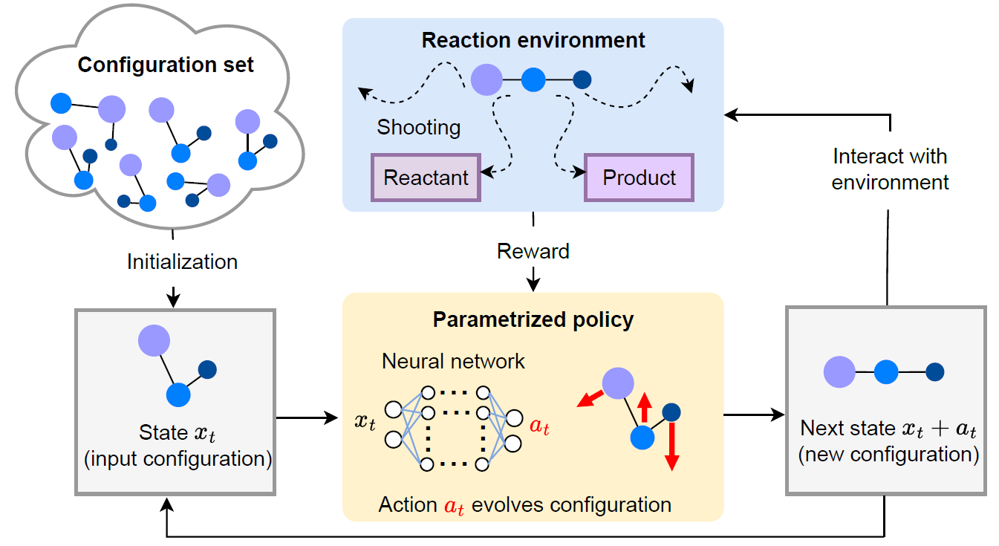

# Probing reaction channels via reinforcement learning
By A, B, C, D and E

This repository provides implementation of the paper "Probing reaction channels via reinforcement learning" [arxiv](https://arxiv.org/pdf/2305.17531.pdf) on identifying the connective configuration with reinforcement learning (especially TD3). 

## Introduction

We propose a reinforcement learning based method to identify important configurations that connect reactant and product states along chemical reaction paths. Such important configurations are called connective configuration, characterized by the reactive probability to observe reactive trajectory crossing it. Utilizing these identified configuration, we can generate an ensemble of configurations that concentrate on the transition path ensemble, which can be further employed in a neural network-based partial differential equation solver to obtain an approximation solution of a restricted Backward Kolmogorov equation.



## Code structure
```commandline
Optimizing measurement
│   README.md    <-- You are here
│
│   env.py  ---> Define a RL environment
│   TD3.py  ---> Define the actor and critic networks
│   utils.py --> Define the replay-buffer
│   train.py --> Main file for training
│   
│   visualize_action.ipynb ---> Visualize the learned actor function
```
## How to run the code
There are some key args: 
```commandline
--maxstep  # number of steps for each episode
--maxepisode # number of episodes
--bound # stop episode if reach low prob. area (i.e., exp(bound))
--noise # extra noise to add to action to promote exploration
```
### Our strategies:
#### Variance-Minimized Shot Assignment:
```commandline
python train.py --gpu_id 0 --env_name Beta6p67 --reward_type log_product --gamma 1 --maxstep 15 --beta 6.67 --T 2 --bound -35 --maxepisode 1000 --noise 0.2
```

## Citing this paper
If you find this paper helps you in your research, please kindly cite:
```
@article{liang2023probing,
  title={Probing reaction channels via reinforcement learning},
  author={Liang, Senwei and Singh, Aditya N and Zhu, Yuanran and Limmer, David T and Yang, Chao},
  journal={arXiv preprint arXiv:2305.17531},
  year={2023}
}
```

## Acknowledgement
Many thanks to nikhilbarhate99 for his simple and clean framework of the [TD3 implementation](https://github.com/nikhilbarhate99/TD3-PyTorch-BipedalWalker-v2).
